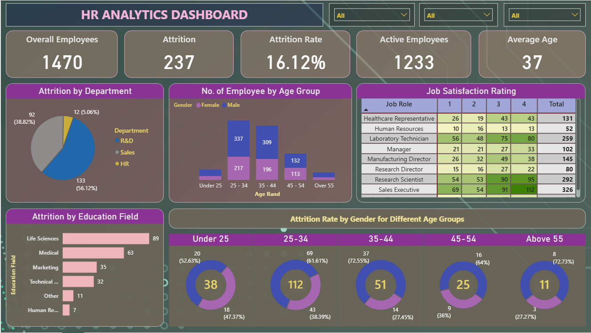

# HR Analytics Dashboard (Power BI)

**Author:** Abhishek Gupta

---

# Project Overview

This project presents an **HR Analytics Dashboard built using Microsoft Power BI** to analyze employee data and understand workforce trends.

The dashboard helps organizations monitor **employee attrition, workforce demographics, job satisfaction, and departmental performance** to support data-driven HR decisions.

---

# Tools & Technologies

* Microsoft Power BI
* Data Visualization
* HR Analytics
* Data Analysis

---

# Dataset

The dataset contains employee-level HR data including:

* Employee demographics
* Department information
* Job role and satisfaction ratings
* Attrition information
* Age groups and education fields

Dataset file:

[Download HR Dataset](HR%20Data.xlsx)

---

# Power BI Dashboard File

Download the full interactive Power BI dashboard:

[Download Power BI Dashboard](HR%20Analytics%20Dashboard.pbix)

---

# Dashboard Preview



---

# Key Dashboard Metrics

The dashboard provides an overview of important HR metrics:

| Metric           | Value  |
| ---------------- | ------ |
| Total Employees  | 1470   |
| Attrition Count  | 237    |
| Attrition Rate   | 16.12% |
| Active Employees | 1233   |
| Average Age      | 37     |

---

# Dashboard Insights

### Employee Distribution

* Total employees in the organization: **1470**
* Active employees: **1233**

### Attrition Analysis

* Total attrition cases: **237**
* Overall attrition rate: **16.12%**

### Department Attrition

Attrition is highest in:

* **Research & Development**
* **Sales**

### Age Group Analysis

Employee distribution across age groups:

* Under 25
* 25–34
* 35–44
* 45–54
* Above 55

### Job Satisfaction Analysis

Job satisfaction scores are analyzed across different job roles such as:

* Healthcare Representative
* Human Resources
* Laboratory Technician
* Manager
* Research Scientist
* Sales Executive

### Education Field Analysis

Attrition is analyzed across education fields such as:

* Life Sciences
* Medical
* Marketing
* Technical Degree
* Human Resources

### Gender Attrition by Age

Attrition patterns are analyzed across gender and different age groups to identify workforce trends.

---

# Project Structure

```
HR-Analytics-PowerBI-Dashboard

Dashboard.png
HR Analytics Dashboard.pbix
HR Data.xlsx
README.md
```

---

# Business Value

This dashboard helps HR teams:

* Monitor employee attrition trends
* Identify high-risk departments
* Analyze workforce demographics
* Improve employee satisfaction
* Support data-driven HR decision making

---

# Author

Abhishek Gupta
Data Science | Data Analytics | Power BI | Python | Machine Learning
